# Data Model (AI)

## 1. Database Diagram

```mermaid
erDiagram
    auth_User {
        int id PK
        varchar username
        varchar first_name
        varchar last_name
        varchar email
        boolean is_staff
        boolean is_active
    }

    NssUser {
        int id PK
        int user_id FK
        varchar slack_handle
        varchar github_handle
    }

    Tag {
        int id PK
        varchar name
    }

    Course {
        int id PK
        varchar name
        date date_created
        boolean active
    }

    Book {
        int id PK
        varchar name
        int course_id FK
        text description
        int index
    }

    Project {
        int id PK
        varchar name
        varchar implementation_url
        varchar client_template_url
        varchar api_template_url
        int book_id FK
        int index
        boolean active
        boolean is_group_project
    }

    ProjectNote {
        int id PK
        int user_id FK
        int project_id FK
        text note
    }

    ProjectTag {
        int id PK
        int project_id FK
        int tag_id FK
    }

    LightningExercise {
        int id PK
        varchar name
        text description
    }

    LightningTag {
        int id PK
        int exercise_id FK
        int tag_id FK
    }

    TaxonomyLevel {
        int id PK
        varchar level_name
    }

    LearningObjective {
        int id PK
        varchar swbat
        int bloom_level_id FK
    }

    ObjectiveTag {
        int id PK
        int objective_id FK
        int tag_id FK
    }

    ProposalStatus {
        int id PK
        varchar status
    }

    Capstone {
        int id PK
        int student_id FK
        int course_id FK
        varchar proposal_url
        varchar repo_url
        text description
    }

    CapstoneTimeline {
        int id PK
        int capstone_id FK
        int status_id FK
        datetime date
    }

    StudentProject {
        int id PK
        int student_id FK
        int project_id FK
        date date_created
    }

    CohortCourse {
        int id PK
        int cohort_id FK
        int course_id FK
        boolean active
        smallint index
    }

    FoundationsExercise {
        int id PK
        varchar learner_github_id
        varchar learner_name
        varchar title
        varchar slug
        int attempts
        boolean complete
        datetime completed_on
        datetime first_attempt
        datetime last_attempt
        text completed_code
        boolean used_solution
    }

    FoundationsLearnerProfile {
        int id PK
        varchar learner_github_id
        varchar learner_name
        varchar cohort_type
        int cohort_number
    }

    Cohort {
        int id PK
        varchar name
        varchar slack_channel
        date start_date
        date end_date
        date break_start_date
        date break_end_date
        boolean active
    }

    CohortInfo {
        int id PK
        int cohort_id FK
        varchar student_organization_url
        varchar github_classroom_url
        varchar attendance_sheet_url
        varchar client_course_url
        varchar server_course_url
        varchar zoom_url
    }

    CohortEvent {
        int id PK
        int cohort_id FK
        varchar event_name
        int event_type_id FK
        datetime event_datetime
        text description
        datetime created_at
        datetime updated_at
    }

    CohortEventType {
        int id PK
        varchar description
        varchar color
    }

    CohortGithubProject {
        int id PK
        int cohort_id FK
        varchar project_name
        boolean assessment
        varchar project_url
    }

    NssUserCohort {
        int id PK
        int nss_user_id FK
        int cohort_id FK
        boolean is_github_org_member
    }

    StudentTeam {
        int id PK
        varchar group_name
        int cohort_id FK
        boolean sprint_team
        varchar slack_channel
    }

    NSSUserTeam {
        int id PK
        int team_id FK
        int student_id FK
    }

    GroupProjectRepository {
        int id PK
        int team_id FK
        int project_id FK
        varchar repository
    }

    Assessment {
        int id PK
        varchar name
        varchar source_url
        int book_id FK
        varchar type
    }

    AssessmentObjective {
        int id PK
        int assessment_id FK
        int objective_id FK
    }

    AssessmentWeight {
        int id PK
        int assessment_id FK
        int weight_id FK
    }

    StudentAssessmentStatus {
        int id PK
        varchar status
    }

    StudentAssessment {
        int id PK
        int student_id FK
        int assessment_id FK
        int status_id FK
        int instructor_id FK
        varchar url
        date date_created
    }

    StudentMentor {
        int id PK
        int student_id FK
        int mentor_id FK
        int capstone_id FK
    }

    StudentNote {
        int id PK
        int student_id FK
        int coach_id FK
        int note_type_id FK
        text note
        datetime created_on
    }

    StudentNoteType {
        int id PK
        varchar label
    }

    StudentPersonality {
        int id PK
        int student_id FK
        varchar briggs_myers_type
        int bfi_extraversion
        int bfi_agreeableness
        int bfi_conscientiousness
        int bfi_neuroticism
        int bfi_openness
    }

    StudentTag {
        int id PK
        int student_id FK
        int tag_id FK
    }

    OneOnOneNote {
        int id PK
        int student_id FK
        int coach_id FK
        text notes
        datetime session_date
    }

    Opportunity {
        int id PK
        int senior_instructor_id FK
        int cohort_id FK
        varchar portion
        date start_date
        text message
    }

    OpportunityUser {
        int id PK
        int student_id FK
        int opportunity_id FK
        date date_created
    }

    LearningWeight {
        int id PK
        varchar label
        int weight
        int tier
    }

    LearningRecord {
        int id PK
        int student_id FK
        int weight_id FK
        boolean achieved
        date created_on
    }

    LearningRecordEntry {
        int id PK
        int record_id FK
        text note
        date recorded_on
        int instructor_id FK
    }

    CoreSkill {
        int id PK
        varchar label
    }

    CoreSkillRecord {
        int id PK
        int student_id FK
        int skill_id FK
        int level
        date created_on
    }

    CoreSkillRecordEntry {
        int id PK
        int record_id FK
        text note
        date recorded_on
        int instructor_id FK
    }

    auth_User ||--|| NssUser : "extends"
    NssUser ||--|| StudentPersonality : "has personality"
    Cohort ||--|| CohortInfo : "has info"

    Course ||--o{ Book : ""
    Book ||--o{ Project : ""
    Book ||--o{ Assessment : ""
    Project ||--o{ StudentProject : ""
    Project ||--o{ ProjectNote : ""
    Project ||--o{ ProjectTag : ""
    Project ||--o{ GroupProjectRepository : ""

    Cohort ||--o{ NssUserCohort : ""
    Cohort ||--o{ CohortCourse : ""
    Cohort ||--o{ CohortEvent : ""
    Cohort ||--o{ StudentTeam : ""
    Cohort ||--o{ Opportunity : ""
    Cohort ||--o{ CohortGithubProject : ""

    Course ||--o{ CohortCourse : ""
    Course ||--o{ Capstone : ""

    CohortEventType ||--o{ CohortEvent : ""

    NssUser ||--o{ NssUserCohort : ""
    NssUser ||--o{ NSSUserTeam : "student"
    NssUser ||--o{ StudentProject : "student"
    NssUser ||--o{ ProjectNote : "user"
    NssUser ||--o{ Capstone : "student"
    NssUser ||--o{ StudentMentor : "student"
    NssUser ||--o{ StudentMentor : "mentor"
    NssUser ||--o{ StudentNote : "student"
    NssUser ||--o{ StudentNote : "coach"
    NssUser ||--o{ OneOnOneNote : "student"
    NssUser ||--o{ OneOnOneNote : "coach"
    NssUser ||--o{ StudentTag : ""
    NssUser ||--o{ StudentAssessment : "student"
    NssUser ||--o{ StudentAssessment : "instructor"
    NssUser ||--o{ Opportunity : "senior_instructor"
    NssUser ||--o{ OpportunityUser : "student"
    NssUser ||--o{ LearningRecord : ""
    NssUser ||--o{ LearningRecordEntry : "instructor"
    NssUser ||--o{ CoreSkillRecord : ""
    NssUser ||--o{ CoreSkillRecordEntry : "instructor"

    StudentTeam ||--o{ NSSUserTeam : ""
    StudentTeam ||--o{ GroupProjectRepository : ""

    Tag ||--o{ ProjectTag : ""
    Tag ||--o{ ObjectiveTag : ""
    Tag ||--o{ LightningTag : ""
    Tag ||--o{ StudentTag : ""

    LightningExercise ||--o{ LightningTag : ""

    TaxonomyLevel ||--o{ LearningObjective : ""
    LearningObjective ||--o{ ObjectiveTag : ""
    LearningObjective ||--o{ AssessmentObjective : ""

    Capstone ||--o{ CapstoneTimeline : ""
    Capstone ||--o{ StudentMentor : ""
    ProposalStatus ||--o{ CapstoneTimeline : ""

    Assessment ||--o{ AssessmentObjective : ""
    Assessment ||--o{ AssessmentWeight : ""
    Assessment ||--o{ StudentAssessment : ""
    LearningWeight ||--o{ AssessmentWeight : ""

    StudentAssessmentStatus ||--o{ StudentAssessment : ""
    StudentNoteType ||--o{ StudentNote : ""

    Opportunity ||--o{ OpportunityUser : ""

    LearningWeight ||--o{ LearningRecord : ""
    LearningRecord ||--o{ LearningRecordEntry : ""
    CoreSkill ||--o{ CoreSkillRecord : ""
    CoreSkillRecord ||--o{ CoreSkillRecordEntry : ""
```



## 2. Database Info

**Database type:** PostgreSQL 16

**ORM:** Django ORM (built-in)

**Engine value** (from `learn-ops-api/LearningPlatform/settings.py`):

```python
DATABASES = {
    'default': {
        'ENGINE': 'django.db.backends.postgresql_psycopg2',
        'NAME': os.getenv("LEARN_OPS_DB"),
        'USER': os.getenv("LEARN_OPS_USER"),
        'PASSWORD': os.getenv("LEARN_OPS_PASSWORD"),
        'HOST': os.getenv("LEARN_OPS_HOST"),
        'PORT': os.getenv("LEARN_OPS_PORT"),
    }
}
```

The `ENGINE` value `django.db.backends.postgresql_psycopg2` tells Django to use the psycopg2 adapter to communicate with PostgreSQL. All connection credentials are loaded from environment variables.

## 3. Model to Table Mapping

| Model Name | Table Name |
|------------|------------|
| Book | learningapi_book |

Django auto-generates table names using the convention `<app_label>_<model_name>` (lowercase). The `Book` model has no `Meta.db_table` override, so it uses the default name `learningapi_book`.

| Property Name | Column Name | Data Type |
|---------------|-------------|-----------|
| id *(auto-added by Django)* | id | SERIAL / BIGINT (primary key) |
| name | name | VARCHAR(75) |
| course *(ForeignKey)* | course_id | INTEGER |
| description | description | TEXT |
| index | index | INTEGER |
| projects *(@property)* | — | no column; computed in Python |
| has_assessment *(@property)* | — | no column; computed in Python |

Source: `learn-ops-api/LearningAPI/models/coursework/book.py`

## 4. Relationship Examples

**One-to-one** (field name: `user`)

- **Models:** `NssUser` and Django's built-in `auth.User`
- **Defined in:** `learn-ops-api/LearningAPI/models/people/nssuser.py`
- **Field:** `user = models.OneToOneField(settings.AUTH_USER_MODEL, on_delete=models.CASCADE)`
- **How it works:** Every `auth.User` has at most one `NssUser` record. `NssUser` extends the built-in user with NSS-specific fields (`slack_handle`, `github_handle`). Django enforces uniqueness on `nssuser.user_id` at the database level. Deleting the `auth.User` cascades and deletes the linked `NssUser`.

**One-to-many** (field name: `course`)

- **Models:** `Course` (one) and `Book` (many)
- **Defined in:** `learn-ops-api/LearningAPI/models/coursework/book.py`
- **Field:** `course = models.ForeignKey("Course", on_delete=models.CASCADE, related_name="books")`
- **How it works:** One `Course` can have many `Book` records, but each `Book` belongs to exactly one `Course`. Django stores `course_id` as a foreign key column in the `learningapi_book` table. The `related_name="books"` allows reverse traversal via `course.books.all()`. Deleting a `Course` cascades and deletes all its `Book` records.

**Many-to-many** (field name: `students`)

- **Models:** `StudentTeam` and `NssUser`, joined through `NSSUserTeam`
- **Defined in:** `learn-ops-api/LearningAPI/models/people/student_team.py`
- **Field:** `students = models.ManyToManyField("NSSUser", through="NSSUserTeam")`
- **How it works:** A `StudentTeam` can have many students, and a student can belong to many teams. Rather than a hidden auto-generated join table, an explicit through model (`NSSUserTeam`) is used, which stores `team_id` and `student_id` as foreign keys. This gives direct access to the join table if additional columns are ever needed.
