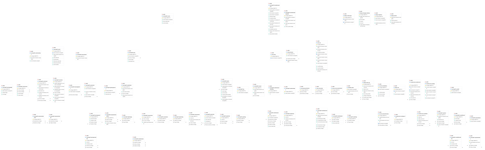

# Data Model

data-model.png

## 1. Database Diagram

## 2. Database Info

**Database type:**

PostgreSQL 16

**ORM:**

Django ORM

## 3. Model to Table Mapping    

| Model Name | Table Name |
|------------|------------|
| Model 1  Assessment   |     LearningAPI_assessment  |
| Model 2  Book  |     LearningAPI_book  |

| Property Name | Column Name | Data Type |
|---------------|-------------|-----------|
| name | name | character varying(255) |
| source_url | source_url | character varying(512) |
| book | book_id | integer |
| type | type | character varying(8) |
| name | name | character varying(75) |
| course | course_id | integer |
| description | description | text |
| index | index | integer |
## 4. Relationship Examples

**One-to-one** (field name: `cohort`)

| Model Name | Table Name | PK Column | FK Column |
|------------|------------|-----------|-----------|
| Cohort | LearningAPI_cohort | id | - |
| CohortInfo | LearningAPI_cohortinfo | id | cohort_id |

**One-to-many** (field name: `book`)

| Model Name | Table Name | PK Column | FK Column |
|------------|------------|-----------|-----------|
| Book | LearningAPI_book | id | - |
| Assessment | LearningAPI_assessment | id | book_id |

**Many-to-many** (field name: `objectives`)

| Model Name | Table Name | PK Column | FK Column |
|------------|------------|-----------|-----------|
| Assessment | LearningAPI_assessment | id | assessment_id |
| LearningWeight | LearningAPI_learningweight | id | weight_id |
| (junction) | LearningAPI_assessmentweight | id | assessment_id, weight_id |