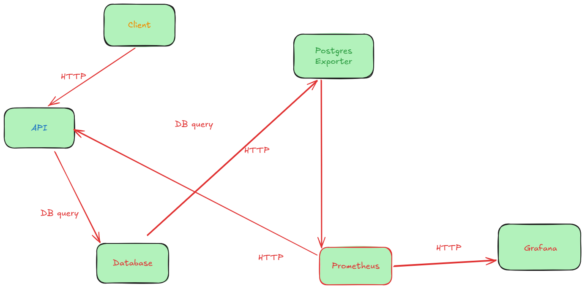
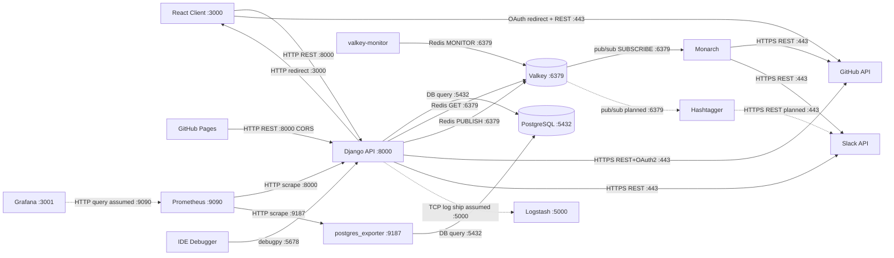

# System Map (AI)

## 1. System Diagram

```mermaid
graph LR
  Client[React Client :3000]
  GHPages[GitHub Pages]
  API[Django API :8000]
  DB[(PostgreSQL :5432)]
  Valkey[(Valkey :6379)]
  ValkeyMon[valkey-monitor]
  Monarch[Monarch]
  Hashtagger[Hashtagger]
  GitHub[GitHub API]
  Slack[Slack API]
  Prometheus[Prometheus :9090]
  Grafana[Grafana :3001]
  PGExporter[postgres_exporter :9187]
  Logstash[Logstash :5000]
  Debugger[IDE Debugger]

  Client -->|HTTP REST :8000| API
  GHPages -->|HTTP REST :8000 CORS| API
  API -->|HTTP redirect :3000| Client
  Client -->|OAuth redirect + REST :443| GitHub
  API -->|DB query :5432| DB
  API -->|Redis GET :6379| Valkey
  API -->|Redis PUBLISH :6379| Valkey
  ValkeyMon -->|Redis MONITOR :6379| Valkey
  Valkey -->|pub/sub SUBSCRIBE :6379| Monarch
  Valkey -.->|pub/sub planned :6379| Hashtagger
  API -->|HTTPS REST+OAuth2 :443| GitHub
  API -->|HTTPS REST :443| Slack
  Monarch -->|HTTPS REST :443| GitHub
  Monarch -->|HTTPS REST :443| Slack
  Hashtagger -.->|HTTPS REST planned :443| Slack
  Prometheus -->|HTTP scrape :8000| API
  Prometheus -->|HTTP scrape :9187| PGExporter
  PGExporter -->|DB query :5432| DB
  Grafana -.->|HTTP query assumed :9090| Prometheus
  API -.->|TCP log ship assumed :5000| Logstash
  Debugger -->|debugpy :5678| API
```
